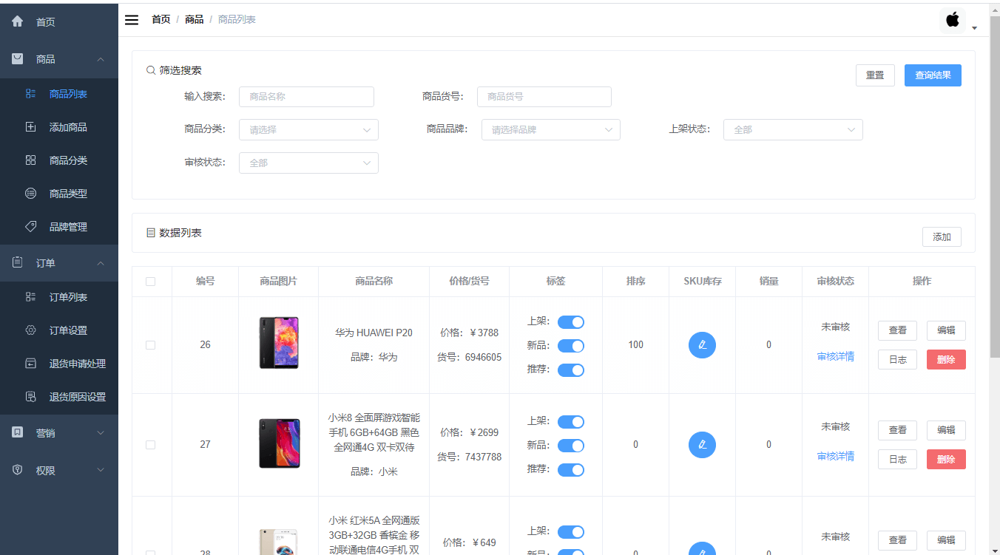
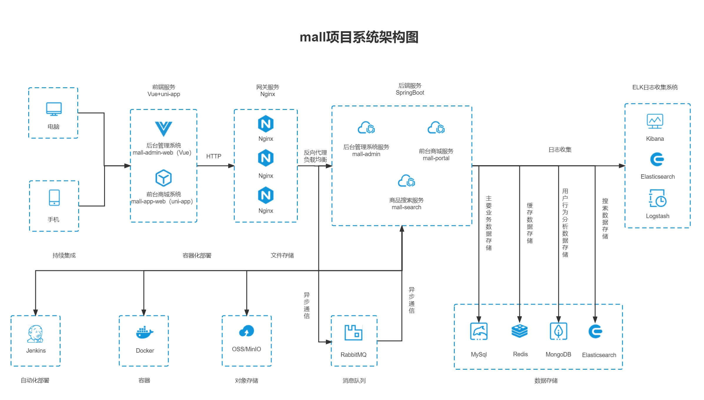

# 大学生二手交易平台
## 项目介绍

`mall`项目是一套电商系统，基于SpringBoot+MyBatis实现，采用Docker容器化部署。
前台系统由其他人员开发，本项目负责的是后台管理系统，包含商品管理、订单管理、人员管理、运营管理、内容管理、统计报表、财务管理、权限管理、设置等模块。

对于后台管理系统参考了若依管理系统的脚手架快速搭建，并学习了若依的核心代码和优势模块，将利己的模块进行保留，缺少的模块进行补充，然后再根据自己的业务进行进一步的设计。

### 管理系统



### 组织结构

``` lua
mall
├── mall-common -- 工具类及通用代码
├── mall-mbg -- MyBatisGenerator生成的数据库操作代码
├── mall-security -- SpringSecurity封装公用模块
├── mall-admin -- 后台商城管理系统接口
├── mall-search -- 基于Elasticsearch的商品搜索系统
└── mall-portal -- 前台商城系统接口
```

### 技术选型

#### 后端技术

| 技术                 | 说明                | 官网                                           |
| -------------------- | ------------------- | ---------------------------------------------- |
| SpringBoot           | Web应用开发框架      | https://spring.io/projects/spring-boot         |
| SpringSecurity       | 认证和授权框架      | https://spring.io/projects/spring-security     |
| MyBatis              | ORM框架             | http://www.mybatis.org/mybatis-3/zh/index.html |
| MyBatisGenerator     | 数据层代码生成器     | http://www.mybatis.org/generator/index.html    |
| Elasticsearch        | 搜索引擎            | https://github.com/elastic/elasticsearch       |
| RabbitMQ             | 消息队列            | https://www.rabbitmq.com/                      |
| Redis                | 内存数据存储         | https://redis.io/                              |
| LogStash             | 日志收集工具        | https://github.com/elastic/logstash            |
| Kibana               | 日志可视化查看工具  | https://github.com/elastic/kibana              |
| Nginx                | 静态资源服务器      | https://www.nginx.com/                         |
| Docker               | 应用容器引擎        | https://www.docker.com                         |
| Jenkins              | 自动化部署工具      | https://github.com/jenkinsci/jenkins           |
| Druid                | 数据库连接池        | https://github.com/alibaba/druid               |
| OSS                  | 对象存储            | https://github.com/aliyun/aliyun-oss-java-sdk  |
| JWT                  | JWT登录支持         | https://github.com/jwtk/jjwt                   |
| Lombok               | Java语言增强库      | https://github.com/rzwitserloot/lombok         |
| Hutool               | Java工具类库        | https://github.com/looly/hutool                |
| PageHelper           | MyBatis物理分页插件 | http://git.oschina.net/free/Mybatis_PageHelper |
| Swagger-UI           | API文档生成工具      | https://github.com/swagger-api/swagger-ui      |
| Hibernator-Validator | 验证框架            | http://hibernate.org/validator                 |

#### 架构图

##### 系统架构图



##### 业务架构图


#### 开发进度

## 环境搭建

### 开发工具

| 工具          | 说明                | 官网                                            |
| ------------- | ------------------- | ----------------------------------------------- |
| IDEA          | 开发IDE             | https://www.jetbrains.com/idea/download         |
| RedisDesktop  | redis客户端连接工具 | https://github.com/qishibo/AnotherRedisDesktopManager  |
| Robomongo     | mongo客户端连接工具 | https://robomongo.org/download                  |
| SwitchHosts   | 本地host管理        | https://oldj.github.io/SwitchHosts/             |
| X-shell       | Linux远程连接工具   | http://www.netsarang.com/download/software.html |
| Navicat       | 数据库连接工具      | http://www.formysql.com/xiazai.html             |
| PowerDesigner | 数据库设计工具      | http://powerdesigner.de/                        |
| Axure         | 原型设计工具        | https://www.axure.com/                          |
| MindMaster    | 思维导图设计工具    | http://www.edrawsoft.cn/mindmaster              |
| ScreenToGif   | gif录制工具         | https://www.screentogif.com/                    |
| ProcessOn     | 流程图绘制工具      | https://www.processon.com/                      |
| PicPick       | 图片处理工具        | https://picpick.app/zh/                         |
| Snipaste      | 屏幕截图工具        | https://www.snipaste.com/                       |
| Postman       | API接口调试工具      | https://www.postman.com/                        |
| Typora        | Markdown编辑器      | https://typora.io/                              |

### 开发环境

| 工具          | 版本号 | 下载                                                         |
| ------------- | ------ | ------------------------------------------------------------ |
| JDK           | 1.8    | https://www.oracle.com/technetwork/java/javase/downloads/jdk8-downloads-2133151.html |
| MySQL         | 5.7    | https://www.mysql.com/                                       |
| Redis         | 7.0    | https://redis.io/download                                    |
| MongoDB       | 5.0    | https://www.mongodb.com/download-center                      |
| RabbitMQ      | 3.10.5 | http://www.rabbitmq.com/download.html                        |
| Nginx         | 1.22   | http://nginx.org/en/download.html                            |
| Elasticsearch | 7.17.3 | https://www.elastic.co/downloads/elasticsearch               |
| Logstash      | 7.17.3 | https://www.elastic.co/cn/downloads/logstash                 |
| Kibana        | 7.17.3 | https://www.elastic.co/cn/downloads/kibana                   |

### 搭建步骤

> Windows环境部署

- Windows环境搭建请参考：[mall在Windows环境下的部署](https://www.macrozheng.com/mall/deploy/mall_deploy_windows.html);
- 注意：如果只启动`mall-admin`模块，仅需安装MySQL、Redis即可;
- 克隆`mall-admin-web`项目，并导入到IDEA中完成编译：[前端项目地址](https://github.com/macrozheng/mall-admin-web);
- `mall-admin-web`项目的安装及部署请参考：[mall前端项目的安装与部署](https://www.macrozheng.com/mall/deploy/mall_deploy_web.html) 。

> Docker环境部署

- 使用虚拟机安装CentOS7.6请参考：[虚拟机安装及使用Linux，看这一篇就够了](https://www.macrozheng.com/tool/linux_install.html);
- 本项目Docker镜像构建请参考：[使用Maven插件为SpringBoot应用构建Docker镜像](https://www.macrozheng.com/project/maven_docker_fabric8.html);
- 本项目在Docker容器下的部署请参考：[mall在Linux环境下的部署（基于Docker容器）](https://www.macrozheng.com/mall/deploy/mall_deploy_docker.html);
- 本项目使用Docker Compose请参考： [mall在Linux环境下的部署（基于Docker Compose）](https://www.macrozheng.com/mall/deploy/mall_deploy_docker_compose.html);
- 本项目在Linux下的自动化部署请参考：[mall在Linux环境下的自动化部署（基于Jenkins）](https://www.macrozheng.com/mall/deploy/mall_deploy_jenkins.html);

> 相关环境部署

- ELK日志收集系统的搭建请参考：[mall项目ELK日志收集解决方案](https://www.macrozheng.com/project/mall_kibana_start.html);
- 使用MinIO存储文件请参考：[使用MinIO实现文件存储](https://www.macrozheng.com/project/minio_console_start.html);
- 读写分离解决方案请参考：[你还在代码里做读写分离么，试试这个中间件吧](https://www.macrozheng.com/project/gaea.html);
- Redis集群解决方案请参考：[Docker环境下秒建Redis集群](https://www.macrozheng.com/blog/redis_cluster.html) 。

大学生二手闲置交易平台（创业版）
>>>>>>> origin/main
